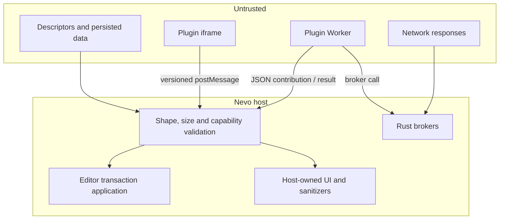

# Plugin SDK V2: security model

SDK V2 исходит из того, что marketplace plugin code, descriptors, network data,
persisted attrs и iframe messages недоверенные. Capabilities — часть
enforcement, а не только текст в диалоге установки.

Trusted SDK V1 исполняется в главном WebView и не имеет этой границы. Новые
marketplace-плагины поэтому обязаны использовать V2.

## Граница доверия



Host проверяет данные на каждом пересечении границы. Успешная проверка manifest
не делает последующие messages доверенными.

## Worker isolation

Worker не получает:

- DOM и host page;
- Tauri API и произвольные IPC commands;
- filesystem;
- direct `fetch`, XHR, WebSocket, WebTransport или EventSource;
- IndexedDB, Cache Storage и cookie store;
- nested Worker/SharedWorker и BroadcastChannel;
- direct `setTimeout`/`setInterval`;
- navigation, notifications и WebRTC.

Entry module загружается через opaque `nevoplugin` token, канонически
привязанный к одному plugin directory. Relative imports остаются внутри этого
каталога; absolute paths, `..` и cross-plugin access отклоняются. Каждый module
или static file, отдаваемый code session, ограничен 5 MiB.

## RPC validation

Worker protocol проверяет:

- protocol version `2.0`;
- request ID и session token;
- известный message type;
- plain JSON shape;
- message size до 1 MiB;
- handler timeout 5 секунд;
- lifecycle/migration timeout 10 секунд;
- liveness sandbox event loop.

JSON values не могут содержать функции, class instances, cycles, `NaN` или
infinite numbers. Contribution definition ограничен 200 registrations.

Timeout посылает cancel request и abort-ит handler signal. Worker, который
падает или блокирует event loop, перезапускается один раз. Повторный fatal
failure переводит plugin в session quarantine, не меняя persisted `enabled`.

Повтор invocation после restart означает, что handler должен быть идемпотентным
до момента возврата результата.

## Editor isolation

Плагин получает snapshot, а не ProseMirror objects. Host:

- включает full `doc` только с `editor.read`;
- принимает mutations только с `editor.write`;
- ограничивает intent 100 operations;
- проверяет positions и schema types;
- отклоняет absolute positions со stale revision;
- применяет все operations одной transaction или не применяет ни одной.

Tier 2 `editor.write.self` ещё уже: frame может patch только attrs собственной
live node. Patch ограничен 256 KiB и снова проходит JSON/schema validation.

## Declarative UI

Host UI DSL:

- использует allow-list elements и attributes;
- escaped attrs bindings;
- допускает максимум один `contentSlot`;
- запрещает inline style, external URLs и DOM callbacks.

Plugin CSS scope-ится по plugin ID и ограничен 64 KiB. Запрещены `@import`,
`@font-face`, `url()`, global selectors и root element selectors.

Tier 1 SVG проходит sanitizer, который удаляет:

- `script`, `foreignObject`, `style`;
- `on*` event attributes;
- external `url()` и `href`;
- другие active-content constructs.

Static host UI остаётся fallback, если render handler недоступен.

## Iframe isolation

Workspace view, modal и Tier 2 block запускаются с:

```html
sandbox="allow-scripts"
```

Без `allow-same-origin`, navigation, popup, form submission и direct network.
`referrerpolicy="no-referrer"`. CSP запрещает connections, nested frames,
objects и base navigation; scripts и static files загружаются только из
plugin-scoped code session.

Bridge:

- принимает messages только от конкретного iframe window;
- проверяет protocol version и message type;
- ограничивает payload 256 KiB;
- передаёт только locale/theme/node attrs и versioned events;
- не передаёт secrets или host objects.

Frame делегирует privileged work Worker через validated `invoke`. Handler ID
opaque и действителен только в текущей plugin session.

## Storage and path isolation

Workspace storage:

```text
.nevo/plugin-data/<pluginId>.json
```

Assets:

```text
.nevo/plugin-assets/<pluginId>/<sha256>
```

Local storage получает app-data namespace с workspace fingerprint и plugin ID.
Plugin ID, storage keys, asset IDs, upload IDs и relative paths валидируются как
одиночные безопасные components. Canonical path checks предотвращают traversal,
symlink escape и cross-plugin access.

Storage quotas:

- 256 KiB на JSON value;
- 5 MiB на storage scope;
- 512 KiB на single-shot asset;
- 8 MiB на chunked asset;
- 64 MiB на asset scope;
- до восьми concurrent uploads.

`nevoplugin-asset` token привязан к asset root одного plugin. Protocol отдаёт
только изображения с распознанными magic bytes; SVG/HTML и arbitrary binary не
становятся renderable content.

## Secrets

`settingsSchema` с `secret: true` сохраняет значение в secure store.
`api.secrets.get()`:

- требует `secrets.read`;
- доступен только Worker;
- использует plugin namespace;
- не передаёт значение iframe.

Плагин сам отвечает за то, чтобы не вернуть секрет как handler result, не
записать его в attrs/storage и не включить в error message.

## Network security

Rust broker повторно читает установленный manifest при запросе и проверяет:

- plugin ID и V2 execution mode;
- capability `network.fetch`;
- HTTPS без username/password;
- exact/wildcard host policy;
- method allow-list;
- safe request headers;
- DNS addresses до connect;
- каждый redirect по тем же правилам;
- response size во время streaming.

Private, loopback, link-local, multicast, documentation и другие non-public
addresses отклоняются, включая IPv4-mapped IPv6. Проверенные DNS addresses
pin-ятся в HTTP client, закрывая DNS rebinding window.

Cookies и browser credentials не используются. `Authorization`,
`Proxy-Authorization`, `Cookie`, `Host`, connection и `sec-*` headers запрещены.
Лимит redirects — пять, timeout — 30 секунд, body — 5 MiB.

Network response всё равно недоверенный: plugin должен валидировать JSON shape,
не вставлять raw HTML/SVG и не превращать server fields в command IDs.

## Marketplace transaction

Install/update использует prepared transaction root:

1. пакет скачивается в отдельный staging directory;
2. manifest, paths и permission fingerprint проверяются;
3. staged Worker запускается только через временную code session;
4. contributions и migrations проверяются до публикации;
5. live editor сохраняет Y.Doc и освобождает старый Worker;
6. plugin directory, storage, registry и затронутые Y.Doc journaled;
7. новая версия публикуется атомарно.

Staged code не видит installed plugin directory. Commit повторно сверяет
fingerprint и installed version, чтобы исключить race между confirmation и
publication.

Незавершённый `committing` journal откатывается при следующем marketplace call.
`committed` journal только очищается.

## Persisted schema fallback

Последняя валидная schema сохраняется в:

```text
.nevo/plugin-registry.json
```

Если plugin disabled, missing или broken, host загружает schema без исполнения
кода. Это сохраняет attrs и rich children в Y.Doc. Export fallback добавляет
безопасный JSON marker и не должен терять вложенный content.

Fallback не заменяет migration compatibility. Переименование node/mark/attrs без
data migration по-прежнему ломает persisted contract.

## Обязанности автора плагина

- Запрашивать минимальные capabilities.
- Валидировать handler input и network response.
- Escape-ить SVG/XML, даже если host дополнительно sanitizes result.
- Не включать secrets в result, logs или persisted JSON.
- Ограничивать собственные collections и recursion.
- Реагировать на `AbortSignal`.
- Делать handlers безопасными для одного retry.
- Не хранить authoritative state только в iframe DOM.
- Сохранять schema names/attrs или писать последовательные migrations.
- Тестировать disabled/missing plugin и export fallback.

## Security review checklist

- [ ] Каждая capability используется.
- [ ] Network policy не шире необходимых hosts/methods.
- [ ] Нет raw HTML/SVG из network без собственной validation/escaping.
- [ ] Нет secret leakage в errors, attrs, storage или iframe.
- [ ] Handler выдерживает повтор invocation.
- [ ] Absolute editor positions используются только при необходимости.
- [ ] Storage keys и collection sizes bounded.
- [ ] Large binary data хранится через assets.
- [ ] Frame работает read-only без `editor.write.self`.
- [ ] Migration проверена на копии legacy Y.Doc.
