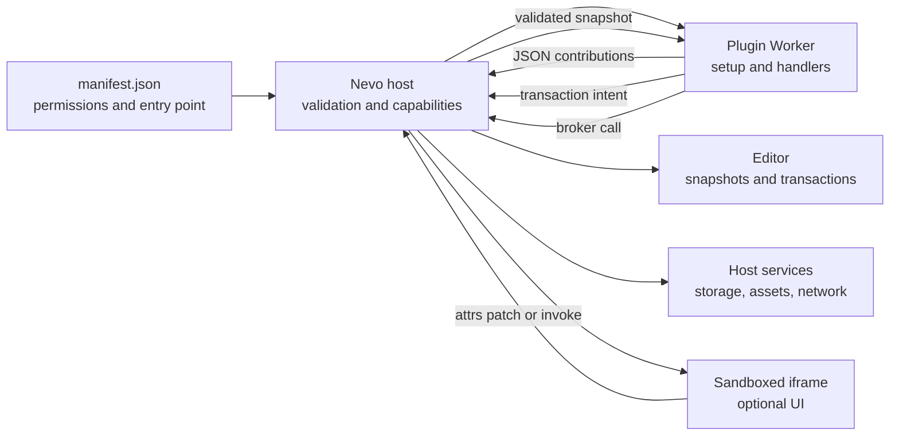

# Nevo Plugin SDK V2

Plugin SDK позволяет расширять редактор и рабочее пространство Nevo без доступа
к внутренним Vue-, ProseMirror- и Tauri-объектам. Marketplace-плагин работает в
изолированном Worker, описывает интерфейс JSON-дескрипторами и просит host
выполнить разрешённые операции через capability-gated API.

> Эта документация относится к `@nevo/plugin-sdk` 2.x и
> `executionMode: "sandboxed-worker"`. Trusted SDK V1 нужен только для
> совместимости с bundled/system, folder и уже установленными legacy-плагинами.
> Новые marketplace-плагины должны использовать SDK V2.

## С чего начать

Если вы пишете первый плагин, читайте страницы в таком порядке:

1. [Быстрый старт и manifest](./plugin-sdk/quickstart.md) — создайте, соберите и
   установите минимальный плагин.
2. [Contributions и lifecycle](./plugin-sdk/contributions.md) — добавьте
   команды, меню, schema, serializers и события.
3. [Работа с редактором](./plugin-sdk/editor.md) — читайте snapshot и возвращайте
   атомарные transaction intents.
4. [UI и пользовательские блоки](./plugin-sdk/ui.md) — выберите host UI,
   безопасный SVG или sandboxed iframe.
5. [Host services](./plugin-sdk/services.md) — storage, settings, secrets,
   assets, network, scheduling и workspace commands.
6. [Тестирование и отладка](./plugin-sdk/testing.md) — unit tests, conformance,
   ручная проверка и типичные ошибки.

Справочные материалы:

- [Capability reference](./plugin-capabilities.md)
- [Security model](./plugin-security.md)
- [Migration from SDK V1](./plugin-sdk-v2-migration.md)
- [Полные примеры Quick Date и Callout](../packages/plugin-sdk/examples)

## Что можно расширить

SDK V2 поддерживает:

- editor commands, keymaps, slash items и toolbar actions;
- schema nodes, marks и собственные block types;
- declarative popovers и decorations;
- Markdown, HTML и Typst serializers, а также fenced-code importers;
- workspace views, sidebar items и modals;
- событие `transactionApplied` и host-managed scheduling;
- plugin-scoped settings, secrets, JSON storage и binary assets;
- HTTPS-запросы к заранее объявленным хостам;
- allow-listed template и kanban commands.

Плагин не может импортировать внутренности Nevo, работать с DOM редактора,
посылать произвольные Tauri-команды или читать файлы рабочего пространства.
Если задача не помещается в опубликованный API, это ограничение SDK, а не
сигнал обходить sandbox.

## Модель выполнения



Граница sandbox проходит в обоих направлениях:

- host передаёт handler только JSON input, editor snapshot и `AbortSignal`;
- handler возвращает JSON, строку, `null` или transaction intent;
- host заново проверяет capability, структуру, размер и актуальность результата;
- DOM и привилегированные сервисы остаются на стороне host;
- iframe не получает capability API и делегирует привилегированную работу Worker.

## Минимальный плагин

`manifest.json` объявляет разрешение на запись в редактор:

```json
{
  "id": "acme.hello",
  "name": "Hello",
  "version": "1.0.0",
  "description": "Adds an insertion command.",
  "enabled": true,
  "kind": "marketplace",
  "source": "marketplace",
  "entryPoint": "index.js",
  "apiVersion": "2.0.0",
  "executionMode": "sandboxed-worker",
  "dataVersion": 1,
  "capabilities": ["editor.write"],
  "settingsSchema": []
}
```

Entry module регистрирует slash item. Contribution ID всегда начинается с
`<pluginId>.`:

```ts
import { definePlugin, transaction } from '@nevo/plugin-sdk'

export default definePlugin({
  setup(api) {
    api.slashItem({
      id: `${api.pluginId}.insert-hello`,
      title: 'Insert hello',
      category: 'text',
      keywords: ['hello', 'greeting'],
    }, (_input, { editor }) => {
      if (!editor) throw new Error('Editor snapshot is required')

      return transaction(editor.revision, [{
        type: 'insertText',
        text: 'Hello from Nevo',
        from: 'selection.from',
        to: 'selection.to',
      }], { scrollIntoView: true })
    })
  },
})
```

`setup` выполняется при загрузке Worker и только регистрирует contributions.
Пользовательское действие вызывает сохранённый handler позже. Подробнее о
порядке вызовов и допустимых дескрипторах — в
[Contributions и lifecycle](./plugin-sdk/contributions.md).

## Публичные импорты

Основной entry point `@nevo/plugin-sdk` экспортирует:

| Экспорт | Назначение |
| --- | --- |
| `definePlugin()` | Объявляет plugin definition |
| `transaction()` | Создаёт editor transaction intent |
| `operations` | Короткие helpers для нескольких частых операций |
| `ui` | Строит безопасное host UI дерево |
| `defineBlockView()` | Запускает runtime внутри Tier 2 block iframe |
| Protocol types | `JsonValue`, snapshots, capabilities, operations и contributions |
| Protocol constants | API/protocol versions и основные лимиты |

`@nevo/plugin-sdk/test-host` экспортирует `createTestPluginHost()` для unit tests.
Он эмулирует регистрацию и вызов handlers, но не заменяет проверки реального
Nevo host.

## Основные правила

1. Объявляйте только необходимые capabilities.
2. Используйте `api.pluginId` при построении каждого contribution ID.
3. Передавайте через API только JSON-совместимые данные: без функций, классов,
   `Date`, `Map`, циклических ссылок и специальных чисел.
4. Для editor handlers используйте `editor.revision` из полученного snapshot.
5. Предпочитайте позиции `selection.from` и `selection.to`: они безопаснее при
   изменившемся документе.
6. Не храните бинарные данные в attrs ноды или JSON storage — используйте
   `api.assets`, а в ноде сохраняйте `assetId`.
7. Считайте schema node names, mark names, attrs и `dataVersion` persisted API.
8. Обрабатывайте отмену через `signal` и укладывайтесь в лимит handler.
9. Не рассчитывайте на DOM, `fetch`, timers или browser storage внутри Worker.
10. Проверяйте плагин в light/dark theme, с клавиатуры и после disable/re-enable.

## Версии и совместимость

- SDK/API version: `2.0.0`;
- Worker protocol version: `2.0`;
- совместимость `apiVersion` определяется по major version;
- `nevoVersionRange` поддерживает точную версию, `^<major>`, `*` и `latest`;
- `dataVersion` — положительное целое и меняется только вместе с persisted data;
- изменение capabilities или network policy меняет permission fingerprint и
  требует нового подтверждения при marketplace update.

Переход с V1 требует переписать registrations и editor mutations, а не только
поменять номер версии. Используйте
[пошаговый migration guide](./plugin-sdk-v2-migration.md).
