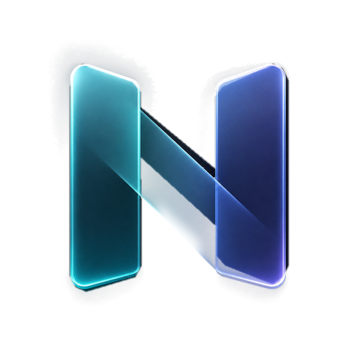
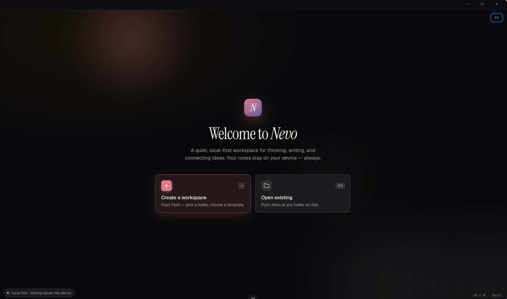
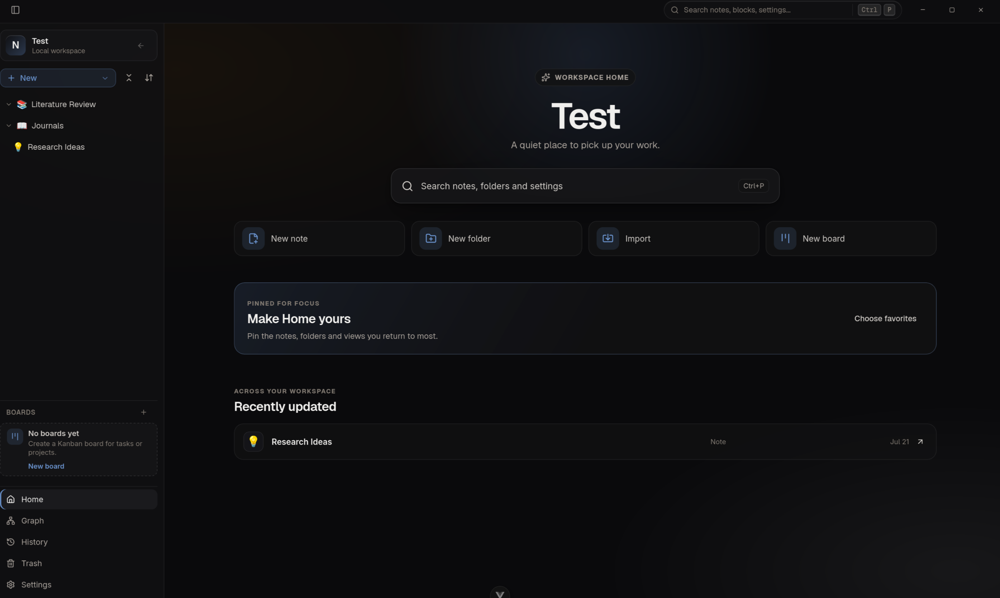
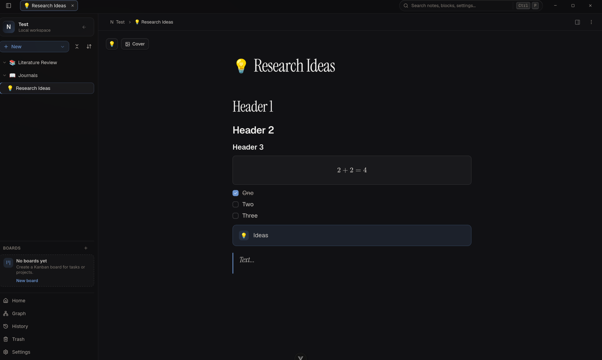

<p align="center">
  
</p>

<h1 align="center">Nevo</h1>

<p align="center">
  <strong>Премиальное local-first пространство для ваших знаний.</strong><br>
  Красиво. Быстро. Только ваше.
</p>

<p align="center">
  📖 <a href="../README.md"><strong>English version of README</strong></a>
</p>

<p align="center">
  
  
  
  
</p>

<p align="center">
  <a href="https://github.com/eliotBenitez/Nevo/releases/latest"><strong>⬇️ Скачать</strong></a>
  &nbsp;·&nbsp;
  <a href="#-возможности"><strong>Возможности</strong></a>
  &nbsp;·&nbsp;
  <a href="#-сборка-из-исходников"><strong>Сборка из исходников</strong></a>
</p>

---

**Nevo** — это минималистичное десктопное приложение для организации знаний, вдохновлённое Notion, Obsidian и SiYuan. Оно сочетает письмо без отвлечений с элегантным интерфейсом в стиле Glassmorphism, а всё созданное остаётся на вашем устройстве.

## 📸 Скриншоты

<table align="center">
  <tr>
    <td colspan="2" align="center"><br><sub>Приветствие — создание или открытие локального пространства</sub></td>
  </tr>
  <tr>
    <td align="center"><br><sub>Главный экран пространства</sub></td>
    <td align="center"><br><sub>Редактор заметки</sub></td>
  </tr>
</table>

## ✨ Возможности

- 🔒 **Local-first** — заметки хранятся на вашем устройстве, а не в чужом облаке.
- ✍️ **WYSIWYG-редактор** — мощный редактор на ProseMirror с Markdown, который форматируется прямо при вводе.
- 🧩 **Богатые блоки** — таблицы с формулами, диаграммы (Mermaid), формулы (KaTeX), рисование, графы и другое.
- ✨ **Glassmorphism-дизайн** — современный полупрозрачный интерфейс с мягким размытием и акцентом на контент.
- ⌨️ **Keyboard-first** — всё под рукой благодаря горячим клавишам и слэш-командам.
- 🚀 **Быстро и легко** — мгновенный запуск на Tauri и Vue 3.

## ⬇️ Скачать

Возьмите свежий установщик для вашей ОС на **[странице релизов](https://github.com/eliotBenitez/Nevo/releases/latest)**:

| Платформа | Установщик |
| --- | --- |
| 🪟 **Windows** | `.msi` или `.exe` |
| 🍏 **macOS** | `.dmg` (Apple Silicon и Intel) |
| 🐧 **Linux** | `.deb`, `.rpm`, AppImage или Flatpak |

После установки Nevo обновляется автоматически. 🎉

<details>
<summary>🍏 macOS: первый запуск блокируется? (сборка без нотаризации)</summary>

Сборки для macOS подписаны ad-hoc, но **не нотаризованы**, поэтому Gatekeeper блокирует первый запуск. Перенесите **Nevo.app** в `/Applications` и один раз сделайте одно из двух:

- Правый клик по приложению → **Открыть** → **Открыть**, **или**
- Выполните в Terminal:
  ```bash
  xattr -dr com.apple.quarantine /Applications/Nevo.app
  ```

</details>

## 🧑‍💻 Сборка из исходников

Хотите собрать сами? Нужны всего три инструмента — **Node.js v20+**, **pnpm** и **Rust (stable)** — плюс WebView/сборочные библиотеки вашей платформы (детали ниже).

```bash
git clone https://github.com/eliotBenitez/Nevo.git
cd Nevo

pnpm install        # зависимости фронтенда
pnpm tauri dev      # запуск в режиме разработки
pnpm tauri build    # production-сборка (.deb / .rpm / AppImage / .dmg / .msi / .exe)
```

<details>
<summary>Установка Rust и pnpm (любая ОС)</summary>

```bash
# Rust (rustup) — macOS / Linux
curl --proto '=https' --tlsv1.2 -sSf https://sh.rustup.rs | sh

# pnpm через Corepack (входит в Node.js ≥ 16.10)
corepack enable && corepack prepare pnpm@latest --activate
```

На **Windows** Rust ставится установщиком [`rustup-init.exe`](https://rustup.rs).

</details>

<details>
<summary>🐧 Системные библиотеки Linux</summary>

Tauri v2 требует `webkit2gtk-4.1` (движок WebView), `libsoup-3.0`, GTK3, `librsvg2`, `openssl`, опциональный трей (`libappindicator/ayatana`) и build-тулчейн (`gcc`, `make`, `pkg-config`).

**Debian / Ubuntu (apt):**
```bash
sudo apt update
sudo apt install -y libwebkit2gtk-4.1-dev build-essential curl wget file \
  libxdo-dev libssl-dev libayatana-appindicator3-dev librsvg2-dev
```

**Fedora (dnf):**
```bash
sudo dnf install -y webkit2gtk4.1-devel openssl-devel curl wget file \
  libappindicator-gtk3-devel librsvg2-devel
sudo dnf group install -y "c-development" "development-tools"
```

**Arch / Manjaro (pacman):**
```bash
sudo pacman -S --needed webkit2gtk-4.1 base-devel curl wget file openssl \
  appmenu-gtk-module librsvg
# Трей (опционально) — пакет из AUR:
# yay -S libappindicator-gtk3
```

**openSUSE (zypper):**
```bash
sudo zypper in -y webkit2gtk3-soup2-devel libopenssl-devel curl wget file \
  libappindicator3-1 librsvg-devel
sudo zypper in -t pattern -y devel_basis
```
> Если на вашей версии openSUSE пакет не найден, проверьте имя: `zypper se webkit2gtk` (для Tauri v2 нужен вариант с поддержкой soup3, в части релизов он называется `webkit2gtk3-devel`).

</details>

<details>
<summary>🍏 Инструменты сборки macOS</summary>

WebView (WKWebView) встроен в систему — отдельный движок не нужен, только инструменты компиляции.

1. **Xcode Command Line Tools** (компилятор C/clang, линкер):
   ```bash
   xcode-select --install
   ```
2. **Node.js v20+** — через [Homebrew](https://brew.sh) или официальный установщик:
   ```bash
   brew install node
   ```
3. **Rust** и **pnpm** — см. «Установка Rust и pnpm» выше.

> Поддерживаются Apple Silicon (`aarch64`) и Intel (`x86_64`). Для universal-бинарника добавьте вторую цель (напр. `rustup target add x86_64-apple-darwin`) и соберите с `pnpm tauri build --target universal-apple-darwin`.

</details>

<details>
<summary>🪟 Инструменты сборки Windows</summary>

1. **Microsoft C++ Build Tools** — установите [Build Tools for Visual Studio](https://visualstudio.microsoft.com/visual-cpp-build-tools/) с компонентом **«Desktop development with C++»** (MSVC + Windows SDK).
2. **WebView2 Runtime** — предустановлен в Windows 11 и актуальных Windows 10. При отсутствии скачайте [Evergreen WebView2 Runtime](https://developer.microsoft.com/microsoft-edge/webview2/).
3. **Rust** — запустите [`rustup-init.exe`](https://rustup.rs) (тулчейн MSVC `stable-x86_64-pc-windows-msvc`).
4. **Node.js v20+** — официальный установщик или `winget install OpenJS.NodeJS`; затем `corepack enable`.

> Всё разом через [winget](https://learn.microsoft.com/windows/package-manager/):
> ```powershell
> winget install Microsoft.VisualStudio.2022.BuildTools Rustlang.Rustup OpenJS.NodeJS Microsoft.EdgeWebView2Runtime
> ```

</details>

<details>
<summary>📦 GStreamer — нужен только для сборки AppImage</summary>

Требуется лишь для `pnpm tauri build` при упаковке в **AppImage** (в `tauri.conf.json` включён `bundleMediaFramework`). Для `pnpm tauri dev` не нужен.

| Дистрибутив | Пакеты |
| --- | --- |
| Debian/Ubuntu | `libgstreamer1.0-dev libgstreamer-plugins-base1.0-dev gstreamer1.0-plugins-good gstreamer1.0-plugins-bad gstreamer1.0-plugins-ugly gstreamer1.0-libav` |
| Fedora | `gstreamer1-plugins-base gstreamer1-plugins-good gstreamer1-plugins-bad-free gstreamer1-plugins-ugly-free gstreamer1-libav` |
| Arch | `gst-plugins-base gst-plugins-good gst-plugins-bad gst-plugins-ugly gst-libav` |
| openSUSE | `gstreamer-plugins-base gstreamer-plugins-good gstreamer-plugins-bad gstreamer-plugins-ugly gstreamer-plugins-libav` |

</details>

## 🛠 Технологический стек

| | |
| --- | --- |
| **Backend** | [Tauri](https://tauri.app/) (Rust) |
| **Frontend** | [Vue 3](https://vuejs.org/) (Composition API) |
| **Язык** | [TypeScript](https://www.typescriptlang.org/) |
| **Редактор** | [ProseMirror](https://prosemirror.net/) |
| **Стейт** | [Pinia](https://pinia.vuejs.org/) |
| **Сборка** | [Vite](https://vitejs.dev/) |
| **Стилизация** | CSS design tokens и глобальные стили проекта |

## 🏗 Архитектура

Nevo придерживается строгих архитектурных границ ради поддерживаемости:

- `src/app/` — основная оболочка приложения и макеты.
- `src/editor-core/` — изолированная логика ProseMirror (схемы, плагины, команды).
- `src/features/` — модульные функции (графы, базы данных, онбординг).
- `src/ui/` — переиспользуемые примитивы интерфейса и анимации.
- `src-tauri/` — Rust-код десктопного бэкенда.

> **Важно:** состояние редактора ProseMirror строго изолировано от Vue/Pinia, чтобы избежать проблем с производительностью и реактивностью.

## 📄 Лицензия

Nevo распространяется под лицензией **AGPL-3.0**. Подробности — в файле [LICENSE](../LICENSE).
